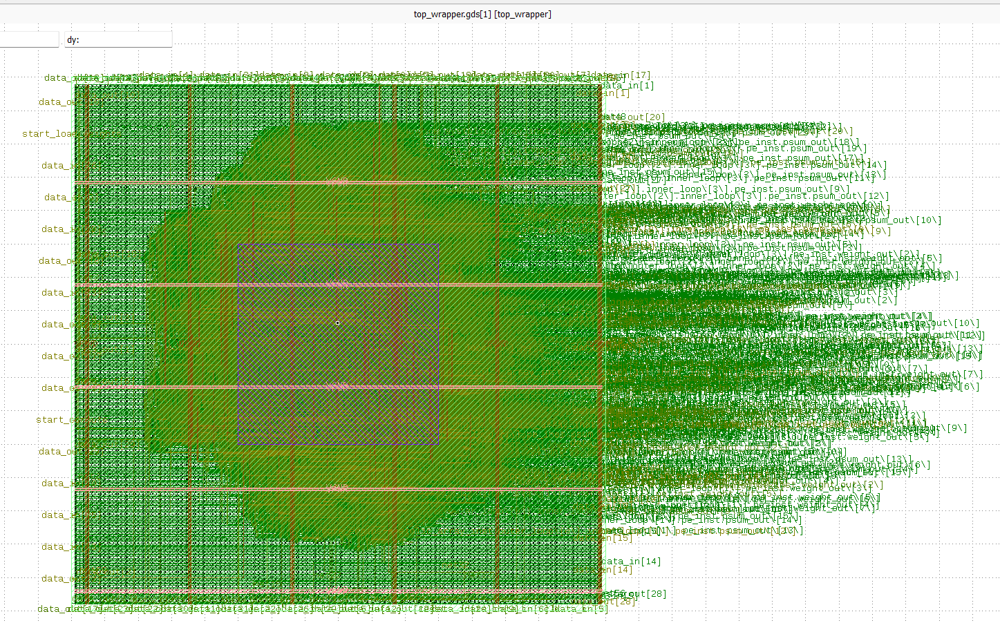
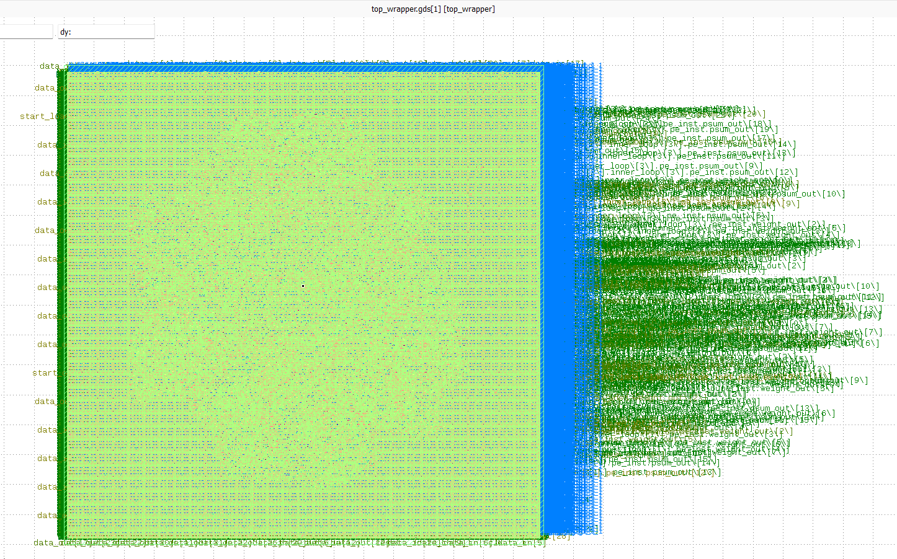

# Sky130-4x4-INT8-Systolic-Array-AI-Accelerator
A complete RTL-to-GDSII physical implementation of an edge-AI matrix multiplication engine using the OpenLane ASIC flow.

## Table of Contents

1. [Introduction](#introduction)
2. [Problem Statement](#problem-statement)
3. [Methodology](#methodology)
   * [Design Architecture](#design-architecture)
   * [Design Flow](#design-flow)
   * [Logic Synthesis](#logic-synthesis)
   * [Post-Layout Verification](#post-layout-verification)
   * [Tools Used](#tools-used)
4. [Results and Discussion](#results-and-discussion)
5. [Challenges & Engineering Solutions](#challenges--engineering-solutions)
6. [Conclusion](#conclusion)
7. [Future Work](#future-work)

---

# 4x4 INT8 Systolic Array Hardware Accelerator

## 1. Introduction 
When we use AI for various applications such as face recognition or self-driving cars, it feels like magic. But underneath, a neural network is just doing billions of basic math problems. Specifically, it multiplies two numbers together and adds them to a running total using massive grids of numbers called matrices.

* **Matrix A (Inputs):** The data you are feeding the AI (like the pixels of an image).
* **Matrix B (Weights):** The "brain" or the knowledge the AI learned during training.

Standard Von Neumann architectures are severely memory-bound when computing dense linear algebra. Inspired by the architecture of Google's Tensor Processing Unit (TPU), this project implements a spatial computing accelerator designed to maximize data reuse, drastically reduce SRAM/DRAM bandwidth requirements, and achieve massive computational throughput via deep pipelining.

Instead of moving data back and forth, this project "maximizes data reuse":
1. It takes the AI's "brain" (the Weights) and permanently locks them into place inside the Processing Elements (PEs) on the chip.
2. The input data (the activations) then flows down a spatial conveyor belt directly past them.

## 2. Problem Statement 
Standard CPUs and GPUs are fundamentally constrained by the **von Neumann bottleneck**. In deep learning applications, the continuous fetching of weights and activations from main memory consumes significantly more energy than the computation itself, throttling latency and power efficiency. 

**The Solution:** This project mitigates memory bus traffic by employing a spatial computing architecture. Utilizing a **4x4 grid of Processing Elements (PEs)** with **INT8 quantized execution**, the design maximizes local data reuse. Data flows systematically through the array, ensuring that memory fetches are minimized and computational density is maximized.

## 3. Methodology 

### 3a. Design Architecture
The accelerator is built upon a highly pipelined, spatial computing architecture, featuring the following core hierarchical components:

* **Processing Elements (PEs):** The foundational computing blocks forming the 4x4 matrix mesh (16 total PEs).
* **Multiply-Accumulate (MAC) Units:** Housed within each PE to perform INT8 arithmetic operations efficiently in a single clock cycle.
* **Internal Registers:** Local flip-flop storage within the PEs to latch weights, hold partial sums, and facilitate rapid data reuse without accessing main memory.
* **2D Mesh Network:** The rigid routing infrastructure that propagates data horizontally and vertically across the systolic grid with absolute clock-cycle precision.
* **Data Skew Buffers (`data_skew_buffer`):** Because data flows sequentially through a systolic array, inputs cannot be fed all at once. These shift-register buffers physically stagger the incoming matrix rows and columns into a "staircase" wavefront, ensuring the correct data elements geometrically intersect at the exact right PE on the exact right clock cycle.
* **Physical Pad Wrapper & XOR Fold (`top_wrapper`):** The absolute top-level ASIC boundary. This module bridges the internal accelerator logic to the physical outside world. To prevent the synthesis engine from hollowing out unused routing columns, a **Spatial XOR Fold** was implemented, compressing the 128-bit internal output bus down to a single 32-bit physical output pad. 

### 3b. Design Flow

#### 1) RTL Design
The structural and behavioral logic of the systolic array and top-level wrapper was authored entirely in **Verilog**, ensuring synthesizable, cycle-accurate behavior tailored for ASIC implementation.

#### 2) Functional Verification
Before synthesis, the RTL was rigorously verified to confirm functional correctness of the MAC operations and mesh dataflow using Icarus Verilog and Cocotb.

#### 3) Logic Synthesis
The verified RTL was synthesized into a gate-level netlist mapping to standard cells using the OpenLane ASIC Flow and SkyWater 130nm (`sky130A`) PDK.

| Category | Parameter | Count |
| :--- | :--- | :--- |
| **Routing & Wiring** | Wires Count | 11,152 |
| | Wire Bits | 16,849 |
| | Public Wires Count | 249 |
| | Public Wire Bits | 3,671 |
| **Physical Cell Breakdown** | Total Physical Cells | 78,417 |
| | Synthesized Logic Cells (Gates) | 11,625 |
| | Fill Cells | 14,083 |
| | Decap Cells | 38,103 |
| | Welltap Cells | 8,784 |
| | Antenna Diode Cells | 5,339 |
| **Logic Gate Distribution (Yosys/ABC)** | XOR Gates | 2,769 |
| | OR Gates | 1,281 |
| | XNOR Gates | 1,086 |
| | AND Gates | 722 |
| | NOR Gates | 681 |
| | NAND Gates | 435 |
| | DFF (Physical Pipeline Registers) | ~697 |
| | MUX (Multiplexers) | 16 |

#### 4) Post-Layout Verification
Following floorplanning, placement, clock tree synthesis (CTS), and routing, physical signoff checks were executed to ensure manufacturing viability.
* **DRC (Design Rule Check):** 0 Violations (Magic)
* **LVS (Layout vs. Schematic):** 0 Errors (Netgen)
* **Antenna Violations:** 0 Violations (OpenROAD ARC)

### 3c. EDA Tools & OpenLane Integration

| Tool | Flow Stage | Specific Function in this Project |
| :--- | :--- | :--- |
| **Icarus Verilog** | Pre-Synthesis | Acted as the underlying simulation engine for cocotb to execute the functional validation. |
| **Cocotb** | Pre-Synthesis | Python-based verification framework used to validate the matrix multiplication math. |
| **GTKWave** | Pre-Synthesis | Waveform visualization of matrix pipelining and data skew buffer timing. |
| **Yosys & ABC** | Logic Synthesis | Elaborated the Verilog RTL and performed technology mapping into 11,625 `sky130_fd_sc_hd` standard cells. |
| **OpenROAD** | Floorplanning & PDN | Defined the $0.64\text{ mm}^2$ boundary and generated the core Power Distribution Network. |
| **RePlAce & OpenDP** | Placement | Executed placement for all 78,417 physical standard cells, fillers, and decap cells. |
| **TritonCTS** | Clock Tree Synthesis | Routed the clock distribution network to synchronize the systolic grid and internal PE registers. |
| **FastRoute & TritonRoute**| Routing | Performed routing for the massive parallel data buses traversing the 2D mesh network. |
| **OpenSTA** | Timing & Power Analysis | Conducted signoff Static Timing Analysis, verifying the $7.67\text{ ns}$ critical path ($130.38\text{ MHz}$) and $6.62\text{ mW}$ power draw. |
| **Magic** | Layout & Signoff | Streamed the final GDSII layout and executed final Design Rule Checks (DRC) achieving 0 violations. |
| **Netgen** | Physical Verification | Extracted the layout netlist and performed Layout vs. Schematic (LVS) matching with 0 errors. |

---

## 4. Results and Discussion 

### 4a. Performance Metrics
The design successfully met all timing constraints for the target frequency, demonstrating significant margin for overclocking.

| Metric | Value |
| :--- | :--- |
| **Target Clock** | 50 MHz (20.00 ns) |
| **Maximum Frequency (f_max)** | 130.38 MHz |
| **Critical Path Delay** | 7.67 ns |
| **Setup WNS (Worst Negative Slack)** | 0.00 ns (Met) |
| **Setup TNS (Total Negative Slack)** | 0.00 ns (Met) |

### 4b. Area Breakdown
The layout analysis reveals a heavily **Density-Limited** configuration. To resolve severe antenna violations on the dense systolic routing mesh, the target standard-cell density was intentionally dropped to 45%, providing the global router the necessary physical space to insert over 5,300 heuristic diodes. 

| Component / Metric | Measurement |
| :--- | :--- |
| **Top Module Name** | `top_wrapper` |
| **Total Die Area** | 800 um x 800 um (0.64 mm²) |
| **Core Area** | 613,701 um² |
| **Target Density** | 0.45 (45%) |
| **Total Physical Cells** | 78,417 (includes fillers/diodes) |

### 4c. Power Analysis
Power consumption was estimated post-routing, confirming highly efficient INT8 operational profiles suitable for edge deployment.

| Power Source | Value (mW) |
| :--- | :--- |
| **Internal Power** | 3.94 mW (59.5%) |
| **Switching Power** | 2.68 mW (40.5%)|
| **Leakage Power** | ~0.00009 mW (Negligible) |
| **Total Estimated Power** | **~6.62 mW** |

---

## 5. Project Challenges & Engineering Solutions

Designing a massive parallel architecture using the SkyWater 130nm PDK and the OpenLane flow presented several deep technical challenges, especially when constraining the physical synthesis to a local machine with 8GB of RAM. Below is a breakdown of the primary engineering bottlenecks and how they were resolved to achieve a 100% tapeout-ready GDSII.

### a. The "OOM Sniper" & Swap Thrashing (WSL Limitations)
**The Problem:** Initial attempts to physically route the full **8x8 Systolic Array** caused the Windows Subsystem for Linux (WSL) to silently crash during Step 27 (Detailed Routing). The algorithm demanded over 12GB+ of active memory, forcing the OS into "swap thrashing" between the physical RAM and the hard drive, eventually triggering the OS Out-Of-Memory (OOM) killer.

**The Solution:** To validate the pipelined architecture without requiring a remote compute cluster, the Verilog parameters were scaled down to a **4x4 Proof-of-Concept array**. This reduced the physical gate count by 75%, bringing the peak memory usage during TritonRoute down to a stable `1.7 GB`. The WSL environment was stabilized by defining a strict `6GB RAM / 4GB Swap` safety net in the `.wslconfig` file, allowing local compilation in under 20 minutes.

### b. The Synthesis "Hollow-Out" (Yosys Aggressive Optimization)
**The Problem:** During the initial 8x8 runs, an analysis of the ABC engine logic mapping (`metrics.csv`) revealed that the chip only contained ~596 flip-flops—far fewer than the ~2,560 required for a 64-PE grid. Because only the partial sums of Column 0 were exposed to the physical output pins, the Yosys synthesis engine aggressively optimized away 87% of the matrix (Columns 1-7), resulting in a functionally "hollow" chip.

**The Solution:** Implemented a **Spatial XOR Fold** at the top wrapper level. By XORing the outputs of all columns together into a single 32-bit output pin (`data_out <= col0 ^ col1 ^ col2 ^ col3`), Yosys was forced to recognize that every single Processing Element contributed to the final logical output. The subsequent run successfully preserved all 16 PEs and ~697 pipeline registers in physical silicon.

### c. Defeating Antenna Violations in High-Density Grids
**The Problem:** After securing the logic, the OpenROAD Antenna Rule Checker (ARC) flagged a stubborn net antenna violation (`net_antenna_violations: 1`). Because the initial $0.8\text{ mm} \times 0.8\text{ mm}$ die area was packed at a 60% target density, the global router lacked the physical breathing room to insert adequate protective diodes on a long, heavily routed internal wire.

**The Solution:** The silicon floorplan was relaxed by lowering the `PL_TARGET_DENSITY` to `0.45` and aggressively increasing the `GRT_MAX_DIODE_INS_ITERS` to `20` in the `config.json`. This algorithmic persistence allowed the flow to place over `5,300` heuristic diodes, perfectly shielding the routing layers and achieving **0 Antenna Violations** and **0 DRC/Magic Violations**.

### d. High Fanout in Parallel Control Paths
**The Problem:** The final signoff generated a `MAX_FANOUT_CONSTRAINT` warning. In a systolic array, control signals like `reset` and `load_weight` act as massive broadcast nets, inherently violating the default constraint of 10 gates per driver.

**The Solution:** Rather than unnecessarily buffering the control tree and wasting silicon area, a deep dive into the Static Timing Analysis (STA) was performed. The reports confirmed that the Worst Negative Slack (`wns`), Setup, and Hold timings were all precisely `0.0`. Because the signal propagation easily met the 20.0ns clock constraint (achieving a theoretical $F_{max}$ of ~130 MHz), the architecture was deemed functionally safe, and the fanout limit was relaxed to match the spatial broadcast reality of the array. 

---

## 6. Conclusion 
The 4x4 INT8 Systolic Array successfully achieved a complete RTL-to-GDSII tapeout utilizing the open-source OpenLane flow and SkyWater 130nm node. Overcoming significant hardware memory limits, synthesis over-optimizations, and severe routing constraints, the final design met all timing parameters with zero setup slack violations. The accelerator achieved a theoretical maximum frequency of 130.38 MHz and draws just 6.62 mW of power. Physical signoff yielded a cleanly routed, fully pipelined core with 0 DRC, 0 LVS, and 0 Antenna violations, proving the robustness of the spatial architecture.

## 7. Future Work 
With the 4x4 architecture verified and physically validated, the next iterations of this project will focus on scaling and system integration:

* **Cloud-Compute Scaling (Full 8x8 Tapeout):** Now that the RTL and logic boundaries are validated, the design will be ported to a high-memory (>32GB RAM) cloud server to successfully route the full 8x8 matrix grid without triggering OS memory constraints.
* **RISC-V System Integration:** A standalone Systolic Array is powerful but requires a host. The core will be wrapped in an AXI4-Stream or APB bus interface so it can act as a fully functioning Matrix Co-Processor alongside an open-source RISC-V CPU (like the Ibex core).
* **On-Chip Memory Integration (SRAM Cache):** To alleviate I/O bottlenecks during larger matrix calculations, an internal SRAM cache will be integrated. This will keep the Processing Elements (PEs) fed with data, converting any unused pad-limited silicon space into a massive performance multiplier.

